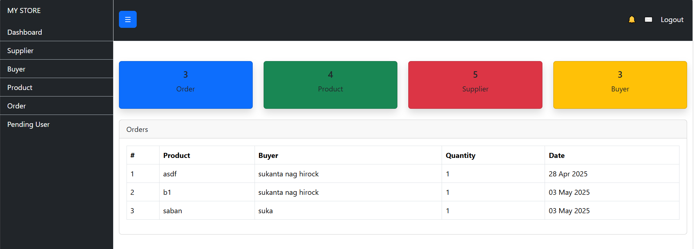
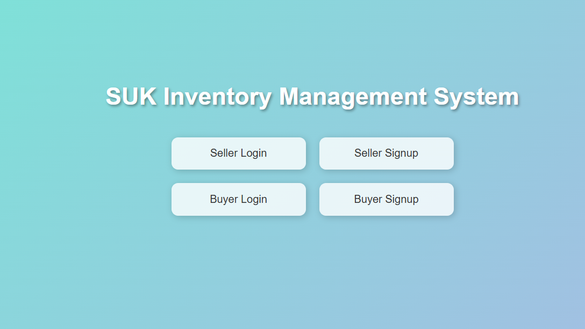
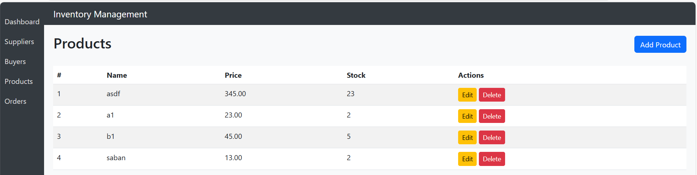

## 📸 Screenshots

### 🧑‍💼 Admin Dashboard

### 🔐 Login Page

### 📦 Product List

````markdown
# 🛒 Inventory Management System (Django)

A Django-based Inventory Management System with role-based user access. Designed for managing buyers, sellers, product inventory, and order tracking.


---


## ✨ Features

- 🔐 Custom user roles: Admin, Buyer, Seller
- ✅ Admin approval system for new registrations
- 📦 Add/update/delete products
- 🛒 Order placement and history (for buyers)
- 📤 Email notifications on key actions
- 📊 Role-based dashboards
- 🔍 Product search and filtering
- 📁 Custom admin panel (not using Django's default)

---

### 🛠️ Tech Stack

- **Backend**: Django 4.x
- **Database**: SQLite3 (default) / PostgreSQL supported
- **Frontend**: HTML, CSS, Bootstrap
- **Others**: SMTP (Email), Django Messages, Crispy Forms (optional)

---

## 🚀 Setup Instructions

### 1. Clone the Repository
```
git clone https://github.com/sukantahirock/inventory-management-django.git
cd inventory-management-django
````

### 2. Create Virtual Environment & Install Dependencies

```bash
python -m venv venv
venv\Scripts\activate       # For Windows
pip install -r requirements.txt
```

### 3. Run Migrations

```
python manage.py migrate
```

### 4. Create Superuser (Admin)

```
python manage.py createsuperuser
```

### 5. Run the Server

```
python manage.py runserver
```

Go to `http://127.0.0.1:8000/` in your browser.

---

## 🧪 Test Accounts (Optional)

| Role   | Username | Password  |
| ------ | -------- | --------- |
| Admin  | admin    | admin123  |
| Buyer  | buyer1   | buyer123  |
| Seller | seller1  | seller123 |

---

## 📄 License

This project is licensed under the MIT License.

---

## 🙋‍♂️ Author

**Your Name** – \[[mail me](mailto:haridasnag01715511031@gmail.com)]
📍 CSE Student, Final Year
🌐 

````

---


## ✅ . Folder Structure Suggestion

```
inventory-management-django/
├── accounts/                
├── dashboard/               
├── templates/
├── static/
├── media/
├── db.sqlite3
├── manage.py
├── requirements.txt
├── README.md
├── .gitignore
```

---

